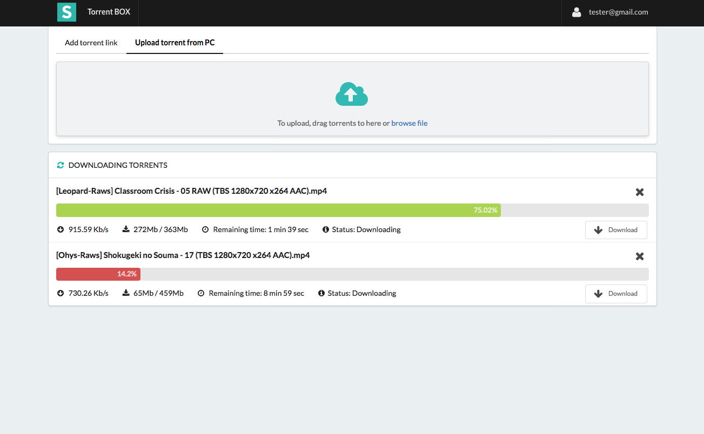

# TorrentBOX

## Screenshot

Multi-user based Torrent download and sharing web service

We need at least two terminal.

    python manage.py runserver 0.0.0.0:8000

    python manage.py celeryd -l info -c 2

celeryd -c option means total number of worker.

If we set -c option to 2, then we can download two torrent simultaneously.
